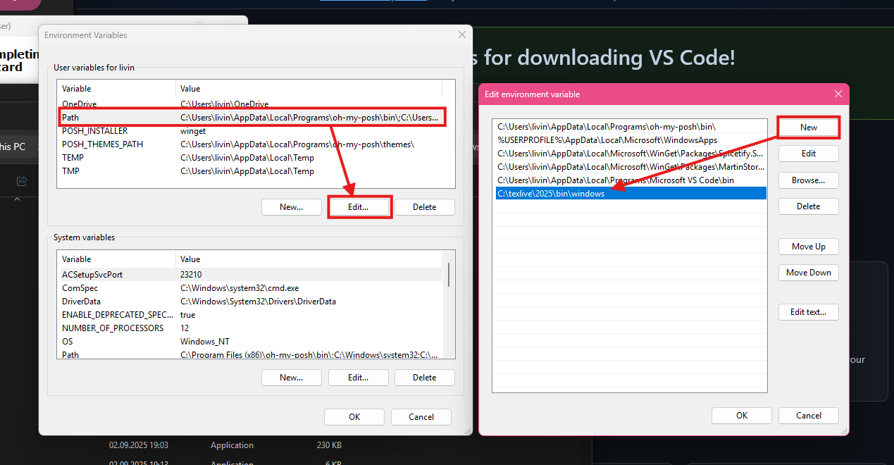
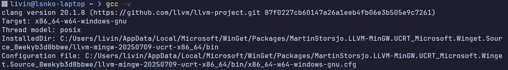
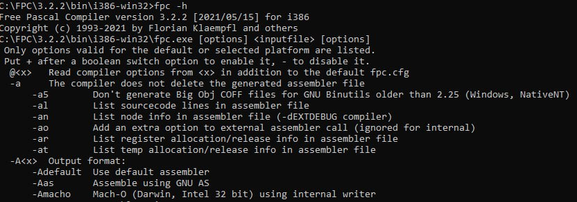

# 🎓 Набор программ и приложений для легкого старта в ВятГУ

Небольшая помощь для первокурсников

## 🔍 Навигация

- [📝 Конспекты](#-конспекты)
- [💻 Программы](#-программы)
- [📖 Учебное пособие по схемам (ГОСТы и Ваша Библия на 4 года)](https://github.com/parzival-2077/vyatsu_starter_kit/blob/main/stuff/%D0%94%D0%BE%D0%BB%D0%B6%D0%B5%D0%BD%D0%BA%D0%BE%D0%B2%D0%B0%2C_%D0%A7%D0%B8%D1%81%D1%82%D1%8F%D0%BA%D0%BE%D0%B2_%D0%9F%D1%80%D0%BE%D0%B3%D1%80%D0%B0%D0%BC%D0%BC%D0%B8%D1%80%D0%BE%D0%B2%D0%B0%D0%BD%D0%B8%D0%B5.pdf)
- [📊 Отчеты](#-отчеты)
- [💾 Github](#-github)
- [📄 Пример отчета](https://www.overleaf.com/read/rdxftkqzmmyj#113ac4)

---

## 📝 Конспекты

### Рекомендуемые инструменты

Конспекты можно вести в:

- Word
- Блокнот
- OneNote
- Google Docs

**Лучшая альтернатива** - [Obsidian](https://obsidian.md/download) (локальный аналог Notion)

### Примеры оформления

| С исходным кодом                                                                                        | Без кода                                                                                                |
| ------------------------------------------------------------------------------------------------------- | ------------------------------------------------------------------------------------------------------- |
|  |  |

📌 [Пример конспекта](/18.03.2025.pdf)

> 💡 **Совет:** Самая удобная тема для Obsidian - "Simply Colorful"

---

## 💻 Программы

### 🔹 PascalABC.NET

[Скачать установщик](https://pascalabc.net/downloads/PascalABCNETSetup.exe)

### 🔹 Lazarus IDE

[Официальный сайт](https://www.lazarus-ide.org/) | 
[Установщик Win64](https://sourceforge.net/projects/lazarus/files/Lazarus%20Windows%2064%20bits/Lazarus%204.2/lazarus-4.2-fpc-3.2.2-win64.exe/download)

### 🔹 Настройка C/C++ в VSCode

Вот тут уже начинаются проблемы, поэтому небольшой гайд.

1. Скачиваем [Visual Studio Code](https://code.visualstudio.com/)
2. Скачиваем установщик [компилятора MSYS2](https://github.com/msys2/msys2-installer/releases/download/2024-12-08/msys2-x86_64-20241208.exe)
3. Запускаем установщик. Соглашаемся со всем, что есть
4. После установки прожимаем галочку "Run MSYS2 now" и завершаем установку.
5. Появится командная строка. В ней пишем(именно пишем, скопировать не получится) - `pacman -S --needed base-devel mingw-w64-ucrt-x86_64-toolchain`
6. Появится вот такая штука. Нажимаем enter 
7. Подтвержаем выбор Y(Yes)
8. Ждем
9. Добавим путь к компиляторам в PATH для удобного использования в терминале:
    - Откройте *Панель управления -> Система -> Дополнительные параметры -> Переменные среды* или введите в поиске *Переменные среды*
    - В переменную `Path` добавьте: `C:\msys64\ucrt64\bin`
    

    - Проверяем установку в терминале:

    ```ps
    gcc -v
    ```

    Всё установилось если после ввода комманды выше вы получили примерно такой вывод:
    
10. Запускаем VS Code
11. Выберите значок «Расширения» на панели активности или используйте сочетание клавиш ( Ctrl+Shift+X )
12. Ищем `C/C++` от Microsoft
13. Выберите Установить
14. Ищем расширение `Code runner` и устанавливаем его
15. Для проверки создайте пустую папку названную латинскими буквами, например `C:\test`
16. Откройте папку в VSCode (Ctrl+K, затем Ctrl+O, выберите эту папку)
17. Создайте новый файл `hello_world.c` в этой папке и вставьте этот код:

    ```c
    #include <stdio.h>

    int main(){
      printf("У вас все получилось! Поздравляю!");
      return 0;
    }
    ```


### 🔹 Настройка Pascal в VSCode (Free Pascal)

0. Можно использовать Pascal ABC и не париться :)
1. Скачиваем [Visual Studio Code](https://code.visualstudio.com/), если до этого не устанавливали
2. Скачиваем установщик [компилятора Free Pascal](https://sourceforge.net/projects/freepascal/files/Win32/3.2.2/fpc-3.2.2.win32.and.win64.exe/download)
3. Запускаем и соглашаемся со всем, что есть
4. По умолчанию **FPC** установится в `C:\FPC\3.2.2\`
5. Добавьте путь **FPC** в `Path`
    - Откройте *Панель управления -> Система -> Дополнительные параметры -> Переменные среды* или введите в поиске *Переменные среды*
    - В переменную `Path` добавьте:
    `C:\FPC\3.2.2\bin\i386-win32`
    

    - Проверяем установку в терминале:

    ```ps
    fpc -h
    ```

    Всё установилось если после ввода комманды выше вы получили такой вывод:
    
6. **ВАЖНО!** после установки **FPC** удалить: `C:\FPC\3.2.2\bin\i386-win32\gcc.exe`, иначе у вас поломается gcc для C/C++
7. Выберите значок «Расширения» на панели активности или используйте сочетание клавиш ( Ctrl+Shift+X )
8. Установите расширения `Code Runner` (если не установленно), `Pascal` и `Pascal Formatter`
9. Для проверки создайте новую папку и откройте ее в VSCode
10. Создайте новый файл `hello_world.pas` и вставьте этот код:

    ```pas
    program Test;
    begin
      writeln('У вас все получилось! Поздравляю!');
    end.
    ```

### 🔹 Microsoft Office

[Microsoft Office](https://cloud.mail.ru/public/zMaw/2ERQnvgHM) | [ONLYOFFICE](https://www.onlyoffice.com/download-desktop.aspx) | [Google Docs](https://docs.google.com/) (онлайн)

### 🔹 Arduino (Информатика 2 семестр)

[Скачать Arduino IDE](https://www.arduino.cc/en/software/) |
[Драйвер CH340](https://wiki.amperka.ru/_media/articles:driver-ch340:ch340ser-windows.zip) | [VSCode + PlatformIO IDE](https://platformio.org/platformio-ide) + [Расширение Serial Monitor](https://marketplace.visualstudio.com/items?itemName=ms-vscode.vscode-serial-monitor)

### 🔹 Logisim-evolution

[Logisim-evolution](https://github.com/logisim-evolution/logisim-evolution/releases/download/v3.9.0/logisim-evolution-3.9.0-x86_64.msi) (Построение и симуляция логических схем)

## 📊 Отчеты

### LaTeX редакторы

- [Overleaf](https://ru.overleaf.com/) (онлайн-редактор)
- [LaTeX в VSCode + LaTeX Workshop](/VSCodeTeX.md) (оффлайн)
- [TeXstudio](https://www.texstudio.org/) (оффлайн)
- [MiKTeX](https://miktex.org/download) (оффлайн)

📄 [Пример отчета](https://www.overleaf.com/read/rdxftkqzmmyj#113ac4)

### Схемы алгоритмов

Используйте [draw.io](https://github.com/jgraph/drawio-desktop/releases/tag/v28.0.6) | [Декстопная версия для Windows](https://github.com/jgraph/drawio-desktop/releases/download/v28.0.6/draw.io-28.0.6-windows-installer.exe)

Скачайте файл нажав `Ctrl+Shift+S`: [Пример схемы алгоритма в drawio](https://github.com/parzival-2077/vyatsu_starter_kit/blob/main/stuff/prototype.drawio)

Откройте его используя drawio

## 💾 Github

Рассмотрим 2 способа для создания/обновления репозитория:

1. [Через сайт](#-через-сайт)
2. [Через командную строку](#-через-командную-строку)

### Через сайт

1. Переходим на сайт [GitHub](https://github.com/)
2. Регистрируемся или входим в аккаунт
3. Чтобы создать репозиторий можно:
    - Нажать на кнопку **"New"** слева на панели, где перечислены ваши репозитории
    - ИЛИ
    - Нажать на кнопку **"+"** в правом верхнем углу рядом со строкой поиска и в выпадающем меню выбрать **"New repository"**
    - 

4. кажите имя репозитория, описание (если нужно), выберите уровень доступа (публичный или приватный), добавьте файл ``README.md`` (рекомендуется).
5. Нажмите на кнопку **"Create repository"**
6. После создания репозитория перед вами откроется такое окно:
    - Кнопка загрузки файлов **"Add file"**(1)
    - Кнопка для клонирования репозитория, открытия в Github Desktop, Visual Studio, а также скачивания репозитория в виде ZIP-архива(2)
    - Список файлов в репозитории(3)
    - Строка поиска по файлам(4)
    - Ветки репозитория(5)
    - Содержание ``README.md`` файла(6)
    - Настройки репозитория - изменение названия, приватности, добавления пользователей, удаление репозитория(7)
   
7. Чтобы загрузить файл, выберете кнопку **"Add file"**(1)
8. Далее вы можете:
    - **Create new file** -  создать новый файл, указать его имя с расширением и написать содержимое.
    - **Upload files** — загрузить существующие файлы с вашего компьютера
9. Введите название коммита (commit message) в поле ниже и нажмите кнопку **"Commit changes"**, чтобы сохранить изменения в репозитории.

Возможности Web-версии:
- Редактирование файлов - как изменить существующие файлы прямо в интерфейсе
- Создание папок - через создание файлов с названием ``папка/файл.txt``
- Просмотр истории изменений - где найти историю коммитов и кто что менял
- Issues (Задачи) - базовая информация о системе задач и баг-трекинга

### Через командную строку


